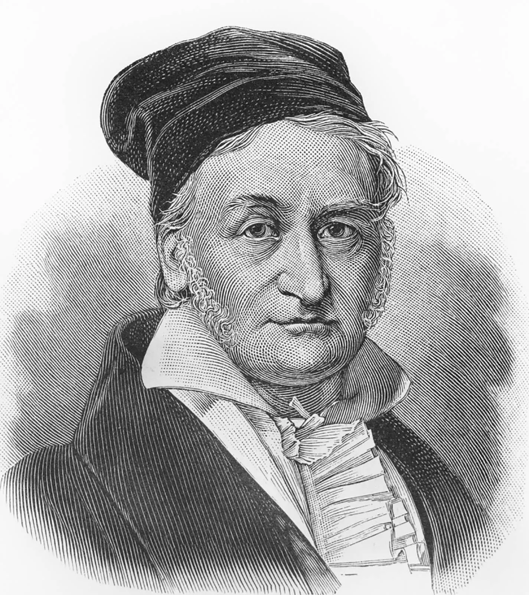

```{r setup, include=FALSE}
knitr::opts_chunk$set(echo = TRUE)
```

## Ignacio Rodriguez - Homework #15

```{r}

X<- rnorm(100)
hist(X)
```

\newpage


{width=20%}
Gauss was a German mathematician known for several different contributions. Including: number theory, geometry, probability theory, among others.
